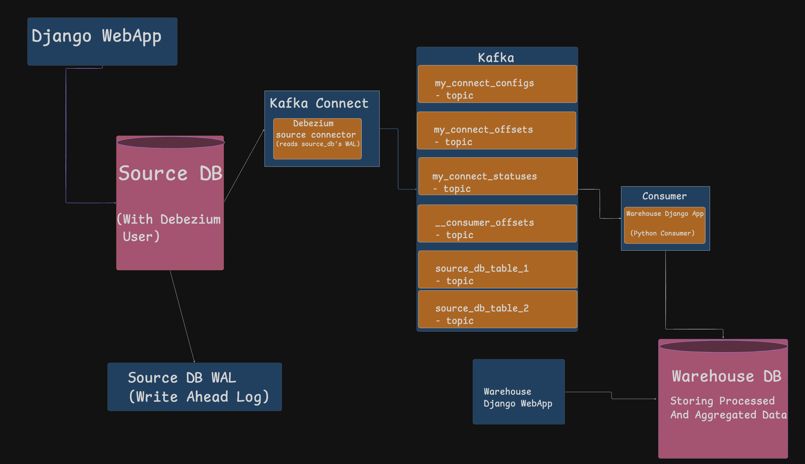

# CDC-Debezium — Data Warehouse PUC

PUC to demo a CDC pipeline: **Postgres → Debezium → Kafka → Python consumer → Postgres warehouse.**

## High-Level Design



## What this project is

- 2 Django projects, 2 Postgres DBs.
- `source_project` — normal OLTP app. Models: `Distributor`, `City`, `Order`.
- `warehouse_project` — holds warehouse models + Kafka consumer.
- Debezium reads `source_db`'s WAL (write-ahead log) and pushes every row change (insert/update/delete) to Kafka topics, in real time, without polling the DB.
- A Python consumer (`warehouse_project`) reads those topics and aggregates the data into the warehouse: `distributor : city : total_amount`.

## Pipeline

```
Postgres (source_db) → Debezium (Kafka Connect source connector) → Kafka topic → Python consumer (upsert) → Postgres (warehouse_db)
```

Concretely:

1. Someone creates/updates/deletes an `Order`, `Distributor`, or `City` row in `source_db` (e.g. via `generate_dummy_orders`, the admin, or the API).
2. Postgres writes that change to its WAL because `source_db` has logical replication enabled for a publication (`dbz_publication`) covering those tables. See [connectors/sql_file_expl.md](connectors/sql_file_expl.md) for how that's set up.
3. The Debezium source connector (running inside Kafka Connect) tails the WAL and publishes one JSON event per row change to a topic named `source.public.<table>` (e.g. `source.public.orders_order`). See [connectors/register_debezium_src_connector.md](connectors/register_debezium_src_connector.md) for how the connector itself is registered/managed.
4. `warehouse_project`'s consumer ([warehouse/consumer.py](warehouse_project/warehouse/consumer.py)) subscribes to those topics, and [warehouse/upserts.py](warehouse_project/warehouse/upserts.py) turns each event into an upsert (or delete) against `warehouse_db`.

## Stack

- Django, PostgreSQL, Kafka (KRaft, no Zookeeper), Kafka Connect + Debezium, `confluent-kafka` (Python client)
- Everything in Docker Compose

## Ports

| Service | URL/Port |
|---|---|
| source_project | localhost:8010 |
| warehouse_project | localhost:8011 |
| source_db | localhost:5442 |
| warehouse_db | localhost:5443 |
| Kafka | localhost:9092 |
| Kafka Connect REST | localhost:8083 |

(Full list also in [readme/urls.md](readme/urls.md).)

## Run

```bash
docker compose up -d --build
```

Then, one-time setup:

```bash
# create the debezium replication role + publication in source_db
docker compose exec -T source-db psql -U postgres -d source_db < connectors/init-debezium-user.sql

# run migrations on both apps
docker compose exec source-app python manage.py migrate
docker compose exec warehouse-app python manage.py migrate

# register the Debezium source connector
curl -X POST -H "Content-Type: application/json" \
  --data @connectors/debezium-postgres-source.json \
  http://localhost:8083/connectors
```

## Generate dummy data

`source_project` ships a management command that seeds a few sample distributors/cities (if missing) and then inserts **1 dummy `Order` per second for 20 seconds** — this is what feeds the whole pipeline in this PUC:

```bash
docker compose exec source-app python manage.py generate_dummy_orders
```

Source: [source_project/orders/management/commands/generate_dummy_orders.py](source_project/orders/management/commands/generate_dummy_orders.py).

## Warehouse models

- `DimCity`, `DimDistributor` — dimension tables, mirrored 1:1 from source (same IDs).
- `FactDistributorCitySales` — one row per `(distributor, city)` pair, `total_amount` incremented on each new order event.

Source: [warehouse_project/warehouse/models.py](warehouse_project/warehouse/models.py).

These are viewable in the Django admin at `localhost:8011/admin/` (see [warehouse_project/warehouse/admin.py](warehouse_project/warehouse/admin.py) — note the models live in the `warehouse` DB alias, not `default`, so the `ModelAdmin`s explicitly route to it).

## Run the consumer

```bash
docker compose exec warehouse-app python manage.py run_consumer
```

Keep this running in its own terminal while you generate dummy orders elsewhere — it'll print every event it receives and how it applied it to the warehouse (see [warehouse_project/warehouse/upserts.py](warehouse_project/warehouse/upserts.py)).

## Event structure (Debezium envelope)

Every Kafka message Debezium produces is a JSON "envelope" like this (example for `source.public.orders_order`, on an `INSERT`):

```json
{
  "schema": { "...": "column type info, omitted here for brevity" },
  "payload": {
    "before": null,
    "after": {
      "id": 42,
      "customer_id": "cust-a1b2c3d4",
      "distributor_id": 1,
      "city_id": 2,
      "amount": "245.30",
      "status": "pending",
      "created_at": "2026-09-28T10:00:00Z",
      "updated_at": "2026-09-28T10:00:00Z"
    },
    "source": { "table": "orders_order", "db": "source_db", "ts_ms": 1758999999000, "...": "..." },
    "op": "c",
    "ts_ms": 1758999999123
  }
}
```

Key fields:

- **`op`** — the kind of change: `"c"` = create, `"u"` = update, `"d"` = delete, `"r"` = read (initial snapshot).
- **`before`** — row state before the change (`null` on create, populated on update/delete).
- **`after`** — row state after the change (`null` on delete).
- **`amount`** — comes through as a **plain decimal string** (e.g. `"245.30"`), because the connector is configured with `"decimal.handling.mode": "string"` in [connectors/debezium-postgres-source.json](connectors/debezium-postgres-source.json). Without that setting, Postgres `NUMERIC`/`DECIMAL` columns are emitted as base64-encoded bytes instead, which is not directly usable — this is why `upserts.py` explicitly wraps it in `Decimal(...)` before doing arithmetic on it.

You can see raw events like this yourself:

```bash
docker compose exec kafka /kafka/bin/kafka-console-consumer.sh \
  --bootstrap-server kafka:9092 \
  --topic source.public.orders_order \
  --from-beginning
```

(swap the topic name for `source.public.orders_city` / `source.public.orders_distributor` to see those)

## More docs

This repo's docs are split up — this file is the overview; the rest go deeper on specific pieces:

| File | What's in it |
|---|---|
| [readme/info.md](readme/info.md) | Core concepts explained — what CDC is, what Kafka Connect is, what the Postgres WAL is |
| [readme/commands.md](readme/commands.md) | Full command cheat-sheet: docker compose lifecycle, shelling into containers, running migrations, psql, listing Kafka topics, tailing a topic |
| [readme/urls.md](readme/urls.md) | Every service's local URL/port |
| [readme/file_structure.md](readme/file_structure.md) | Repo layout — where each Django project's files live |
| [connectors/sql_file_expl.md](connectors/sql_file_expl.md) | Line-by-line explanation of `init-debezium-user.sql` (the replication role + publication setup) and the resulting `source_db` table list |
| [connectors/register_debezium_src_connector.md](connectors/register_debezium_src_connector.md) | How to register/inspect/update the Debezium connector via the Kafka Connect REST API, including how to add/remove tables later |
